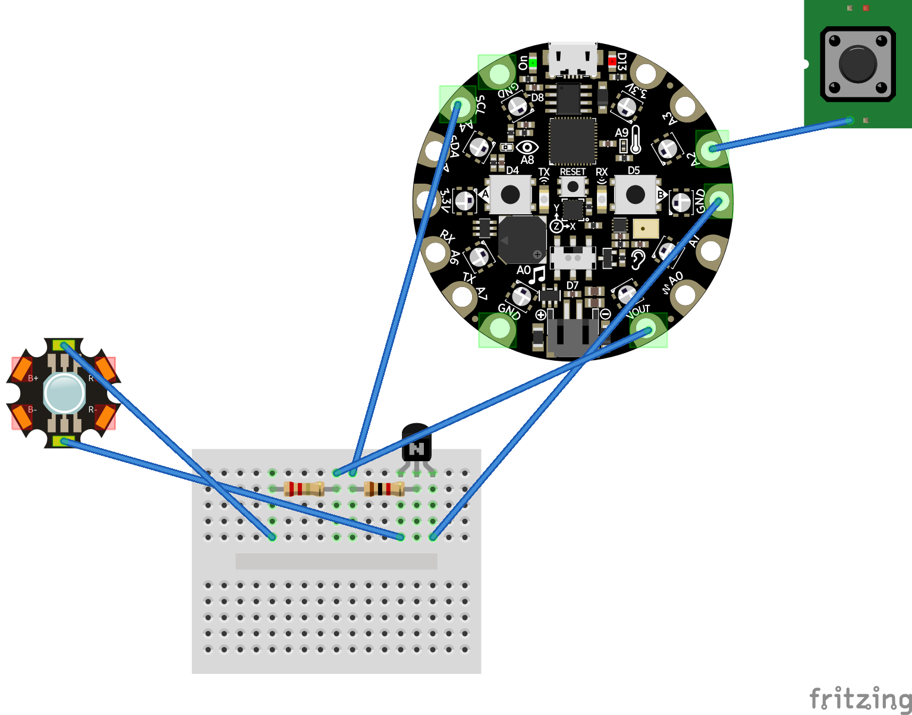
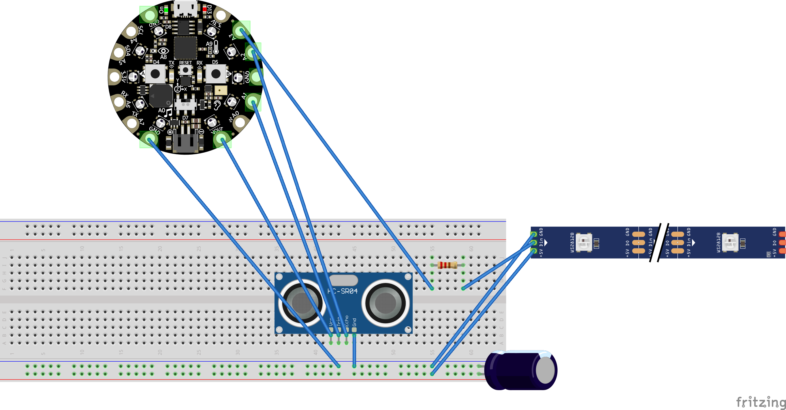

# Sesión 15

Soluciones a proyectos.

## LED de alto brillo, tacto capacitivo y CPX

Para controlar un led con tacto capacitivo

- [Código de makecode](./ledcpx/ledcpx.uf2)
- 

## Matrix de 15x15 e imágenes

Para pasar imágenes "pixeleadas" y subirlas a una matriz de leds

- [Enlace](https://editor.p5js.org/emilioocelotl/sketches/LL_nuDLKr) para convertir imágenes en p5 y copiarlas al código de arduino
- [Código](../s14/imgConMic/imgConMic.ino) de Arduino. Nota: Es importante tener al menos tres imágenes convertidas.

Nota 2: Algunos LEDs pueden fallar. Revisar fila por fila. 

## Filas de leds en una matriz y sensor ultrasónico

- [Código](../s13/sensorUltraYLEDs/sensorUltraYLEDs.ino) de Arduino para controlar filas de LEDs con un sensor ultrasónico.
-  para conectar la tira y el sensor 

## Intervalos de tiempo y filas de una matriz

Para determinar intervalos de tiempo de acuerdo al calendario lunar.

## Evitar sonido en la CPX cuando hay eventos

## Control de tira de leds 